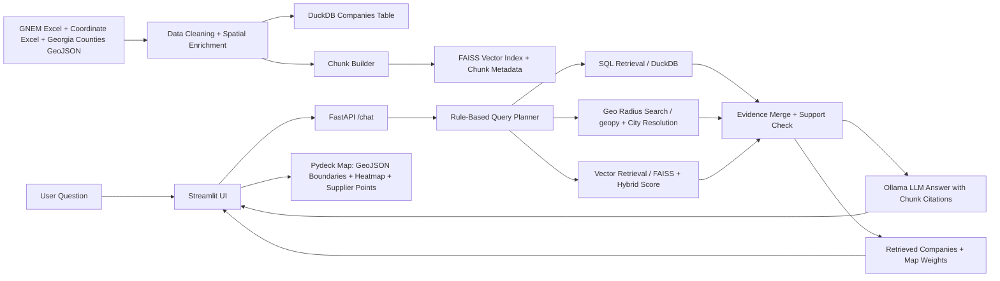

# Poster Methods Guide: Hybrid GeoJSON Map + Geospatial RAG System

This guide summarizes the **approach, system design, and methods** implemented in this project so you can place them neatly in a research poster. It is written to be **poster-ready**, with short text blocks, suggested figures, and implementation details that match the current code.

## 1. Suggested Poster Title

**Hybrid Geospatial Retrieval and GeoJSON-Based Supplier Mapping for Georgia EV Supply Chain Analysis**

Alternative shorter title:

**GeoJSON-Driven Geospatial RAG Mapping of Georgia EV Supply Chain Companies**

## 2. One-Sentence Research Objective

This system integrates **Georgia county GeoJSON boundaries**, **company location enrichment**, **SQL retrieval**, **FAISS-based semantic search**, and a **local Ollama LLM** to answer supply-chain questions and visualize retrieved companies on an interactive map.

## 3. Recommended Poster Layout

Use a **3-column poster design** so the workflow is easy to follow.

| Left Column | Center Column | Right Column |
|---|---|---|
| Research problem, dataset description, study region map | Methodology pipeline, system architecture, retrieval + GeoJSON processing | Output examples, map interpretation, strengths, limitations, future work |

### Suggested visual style

| Element | Recommendation |
|---|---|
| Main colors | Deep navy + teal + light gray background |
| GeoJSON county borders | Dark gray / navy outline |
| Exact company coordinates | Teal markers |
| Source-sheet coordinates | Blue markers |
| County-centroid fallback | Orange markers |
| Missing coordinates | Muted red |
| Fonts | One clean sans-serif font, bold section headers, short bullet text |

## 4. Poster-Ready Methodology Summary

You can paste this directly into a **Methods** box:

> We developed a hybrid geospatial retrieval and mapping pipeline for Georgia supply-chain company data. Company records were ingested from Excel, standardized, and spatially enriched using latitude/longitude values from a coordinate workbook. When exact coordinates were unavailable, Georgia county polygons from GeoJSON were used to compute county-centroid fallback coordinates. Each company record was transformed into four semantic text chunks describing profile, supply-chain relationships, products/capabilities, and geographic operations. Structured company rows were stored in DuckDB, while chunk embeddings were indexed in FAISS for semantic retrieval. At runtime, a rule-based query planner routes each user question to SQL retrieval, vector retrieval, geospatial radius filtering, or a hybrid combination. Retrieved evidence is validated before answer generation to reduce unsupported responses. A local Ollama LLM then generates a citation-based natural-language answer from retrieved chunks only. The frontend renders both evidence tables and a query-aware supplier map using GeoJSON county boundaries, a heatmap layer, and point markers weighted by relevance, query match, proximity, business priority, and metric importance.

## 5. End-to-End System Design

### Architecture figure for your poster



### Short figure caption

**Figure X.** System architecture of the hybrid geospatial RAG workflow. Excel company records and Georgia county GeoJSON are converted into structured and semantic retrieval assets. User questions are routed to SQL, vector, and geospatial engines, then returned as a citation-based answer and a GeoJSON-supported supplier map.

## 6. How GeoJSON Is Used in This Project

This is the most important part for your poster if you want to explain **how GeoJSON works in your method**.

### GeoJSON role 1: county boundary visualization

`data/Counties_Georgia.geojson` is loaded in the frontend and rendered as a **Pydeck GeoJsonLayer** so county outlines appear under the supplier points.

### GeoJSON role 2: fallback geolocation using county centroids

During ingestion, the backend reads each county polygon or multipolygon from GeoJSON, extracts all boundary coordinates, and computes a **mean latitude/longitude centroid**. If a company has no exact coordinate in the Excel inputs, the company is assigned the centroid of its county.

### GeoJSON role 3: city/county resolution for distance search

At query time, when a user asks for companies **near a city**, the spatial engine resolves that city using:

| Priority | Method |
|---|---|
| 1 | Average coordinates of known companies in that city |
| 2 | Matching county centroid from GeoJSON |
| 3 | Built-in city-to-county aliases, such as Atlanta -> Fulton |
| 4 | Nominatim geocoding fallback for Georgia city names |

### Coordinate source hierarchy

Use this table in your poster to explain spatial data quality:

| Priority | Coordinate Source | Meaning |
|---|---|---|
| 1 | `source_excel` | Latitude/longitude already present in the main company sheet |
| 2 | `coordinates_excel:*` exact company + location match | Best external enrichment match from the coordinate workbook |
| 3 | `coordinates_excel:*` company-only match | Company-level coordinate enrichment when exact location match is unavailable |
| 4 | `county_centroid` | GeoJSON-derived county centroid approximation |
| 5 | `missing` | No usable coordinate found |

### Short poster sentence for GeoJSON

> Georgia county GeoJSON is used both as a cartographic boundary layer and as a spatial fallback mechanism: county polygons are rendered on the frontend map, while polygon coordinates are converted into county centroids to estimate company locations when exact latitude/longitude values are missing.

## 7. Retrieval and Answer Generation Method

### Query planner

The backend uses a rule-based planner to classify the question as:

| Query Type | Trigger Examples | Retrieval Used |
|---|---|---|
| `SQL_QUERY` | top companies, employment, industry, OEM filtering | DuckDB |
| `GEO_QUERY` | near, within, miles, km, coordinates | geopy distance search |
| `VECTOR_QUERY` | supplier, battery, OEM, products, capabilities | FAISS semantic search |
| `HYBRID_QUERY` | queries mixing location + supplier/product/OEM constraints | combined SQL + vector + geo |

The planner also extracts hints such as **city**, **radius_km**, **coordinates**, **OEM**, **industry group**, **category term**, and **capability term**.

### Semantic chunking strategy

Each company row is converted into **4 chunk types**, which improves retrieval because different question styles can match different company descriptions.

| Chunk Type | What it Contains |
|---|---|
| `company_profile` | company name, category, industry group, facility type, EV supply-chain role |
| `supply_chain` | OEM relationships, affiliation type, EV/battery relevance |
| `products_capabilities` | product/service text, industry group, category |
| `geo_operations` | location, city, county, latitude, longitude, coordinate source, employment |

### Vector retrieval scoring

FAISS returns nearest chunks, and each result is reranked using a **hybrid semantic + lexical score**:

```text
hybrid_score = 0.8 * semantic_similarity + 0.2 * lexical_overlap
```

If the SentenceTransformer model is unavailable locally, the system falls back to a **deterministic hashed-token 384D embedding**. The currently generated index uses `hash-fallback` with `hashed-token-384`.

### Evidence guard

To reduce hallucination, the backend checks whether retrieved chunks actually overlap with the question. If SQL/geo retrieval returns nothing and vector evidence has weak lexical/semantic support, the system returns a **no-evidence response** instead of forcing an LLM answer.

### LLM usage

The local Ollama model is used **only after retrieval**. It does **not** calculate distances or draw the map. Its role is to summarize retrieved evidence and cite chunk IDs such as `[C1]`, `[C2]`. If the first model fails, smaller local fallback models are tried, and if all fail, a fast retrieval-only summary is returned.

## 8. Geospatial Mapping and Visualization Design

### Map layers used in the frontend

| Layer | Purpose |
|---|---|
| `GeoJsonLayer` | Draw Georgia county boundaries from `Counties_Georgia.geojson` |
| `HeatmapLayer` | Show density/intensity of retrieved supplier locations |
| `ScatterplotLayer` | Show individual company points with tooltips and radius scaling |

### Query-aware map weighting

Each mapped company receives a `map_weight` score that controls marker size and heatmap contribution.

```text
map_weight = weighted average of
  0.30 * retrieval relevance
  0.25 * query-text match
  0.20 * geographic proximity
  0.15 * business priority
  0.10 * metric score
```

This means companies that are **closer**, **more textually relevant**, and **more important to the queried supply-chain role** appear with stronger heat intensity and larger markers.

### Tooltip information

Each point tooltip shows **company name**, **supply-chain role**, **city/county**, and **coordinate source** so map interpretation remains transparent.

## 9. Dataset and Implementation Summary

These values were read from your current generated artifacts and can be used in the poster.

| Item | Value |
|---|---|
| Company records ingested | 207 |
| Semantic chunks indexed | 828 |
| Chunk types per company | 4 |
| Georgia county GeoJSON features | 159 |
| GeoJSON geometry types | 154 Polygon, 5 MultiPolygon |
| Exact/enriched company coordinates | 202 |
| County-centroid fallback coordinates | 4 |
| Missing coordinates | 1 |
| Structured database | DuckDB |
| Semantic index | FAISS |
| Web backend | FastAPI |
| Frontend map UI | Streamlit + Pydeck |
| Distance computation | geopy |
| Local LLM interface | Ollama-compatible OpenAI client |

## 10. Poster Figure Suggestions

### Figure 1: Study area + company map

Show Georgia county boundaries with supplier markers and heatmap intensity.

Suggested caption:

**Figure 1.** Retrieved supplier locations across Georgia overlaid on county GeoJSON boundaries. Marker size and heat intensity reflect query-aware relevance and proximity scores; color indicates coordinate provenance.

### Figure 2: Methodology pipeline

Use the architecture diagram from Section 5.

### Figure 3: Example question-answer output

Show one screenshot of:

| Panel | What to Highlight |
|---|---|
| Chat answer | LLM response with chunk citations |
| Retrieved chunks table | Evidence transparency |
| Retrieved companies table | Structured records and distances |
| Map | Spatial distribution of result companies |

### Figure 4: Coordinate provenance legend

Add a small legend box:

| Color | Meaning |
|---|---|
| Teal | Coordinate workbook match |
| Blue | Source Excel coordinate |
| Orange | GeoJSON county centroid fallback |
| Red | Missing coordinate |

## 11. Very Short Poster Text Blocks

If poster space is tight, use these compact blocks.

### Data

207 Georgia supply-chain company records were integrated with an external coordinate workbook and 159 county polygons from Georgia GeoJSON.

### Method

A hybrid retrieval pipeline combines DuckDB SQL filtering, FAISS semantic chunk search, and geopy-based radius filtering. County GeoJSON is used for both map boundaries and centroid fallback geolocation.

### Visualization

Streamlit + Pydeck renders county GeoJSON outlines, supplier points, and a heatmap layer. Marker size and heat intensity are weighted by relevance, query match, proximity, business priority, and metric score.

### Trust and explainability

Retrieved chunks are shown as evidence, LLM answers cite chunk IDs, and unsupported out-of-domain questions are rejected by an evidence guard.

## 12. Strengths, Limitations, and Future Work

| Category | Poster Text |
|---|---|
| Strength | Combines structured, semantic, and geospatial retrieval in one local pipeline with interpretable map outputs |
| Strength | GeoJSON supports both visualization and coordinate fallback, improving coverage when exact latitude/longitude is missing |
| Strength | Evidence guard and chunk citations improve answer traceability |
| Limitation | County-centroid fallback is approximate and may shift companies away from their true facility location |
| Limitation | Current map shows supplier result points and density, but not full logistics infrastructure such as ports, rail, and interstates |
| Limitation | City extraction and keyword planning are rule-based, so ambiguous natural-language queries may need more robust NLP |
| Future Work | Add road, rail, and port layers; draw search-radius circles; improve facility geocoding; evaluate retrieval quality quantitatively |

## 13. Suggested Final Poster Storyline

If you want the poster to read smoothly, present the story in this order:

```text
Research Question
-> Data Sources
-> GeoJSON Spatial Enrichment
-> Hybrid Retrieval Architecture
-> Query-Aware Map Visualization
-> Example Results
-> Strengths / Limitations / Future Work
```

## 14. Where Each Method Is Implemented in Code

| Method | Code File |
|---|---|
| Data cleaning, GeoJSON centroid extraction, coordinate enrichment, chunking, DuckDB + FAISS asset creation | `backend/ingestion.py` |
| Query classification and hint extraction | `backend/query_planner.py` |
| Structured SQL retrieval | `backend/sql_engine.py` |
| City resolution and radius-based distance filtering | `backend/spatial_engine.py` |
| FAISS search and hybrid semantic/lexical scoring | `backend/vector_engine.py` |
| Retrieval orchestration, evidence guard, map-weight scoring, LLM prompting/fallbacks | `backend/rag_pipeline.py` |
| FastAPI `/chat` and `/health` API | `backend/main.py` |
| Streamlit chat UI, auto-backend startup, GeoJSON county layer, heatmap/scatter map, result tables | `frontend/app.py` |
| LLM fallback tests and model-selection tests | `tests/test_rag_pipeline_llm.py` |

## 15. My Recommendation for Your Poster

For the **Methods** section, do not show every code detail. Instead, use:

1. One clean workflow diagram from Section 5
2. One short GeoJSON explanation box from Section 6
3. One compact table showing the 4 retrieval/mapping components
4. One map screenshot with a coordinate-source legend
5. One small metrics box with `207 companies`, `828 chunks`, `159 county polygons`

If you want, I can next convert this into a **more visually styled poster Markdown page** with a **ready-to-copy 3-column poster layout**, or I can make a **shorter conference-poster version** that fits into a single **Methods + System Design** panel.
