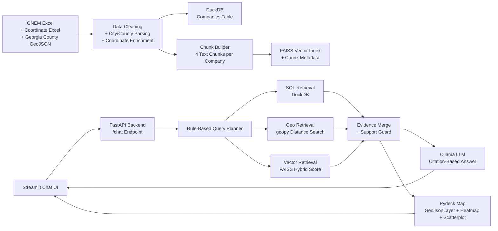

# Hybrid Geospatial Retrieval and GeoJSON-Based Supplier Mapping

## Poster Visual Layout

| **1. Study Context + Data** | **2. Methods + System Design** | **3. Outputs + Interpretation** |
|---|---|---|
| **Research Goal**  Develop a GeoJSON-supported geospatial retrieval system that answers questions about Georgia EV supply-chain companies and maps relevant suppliers interactively.  **Data Sources**  `gnem_companies.xlsx` GNEM company records, OEM relationships, product/service data, employment, and location fields.  `GNEM - Auto Landscape Lat Long Updated File (1).xlsx` Latitude/longitude enrichment for company locations.  `Counties_Georgia.geojson` Georgia county boundary polygons and county fallback geometry.  **Study Region**  Georgia, USA county-level spatial framework.  **Dataset Summary**  \| Item \| Value \| \|---\|---\| \| Companies \| 207 \| \| Semantic chunks \| 828 \| \| GeoJSON counties \| 159 \| \| Exact/enriched coords \| 202 \| \| County-centroid fallback \| 4 \| \| Missing coords \| 1 \| | **Method Pipeline**  1. Clean company Excel data 2. Extract city/county from location text 3. Attach coordinates from enrichment workbook 4. Use GeoJSON county centroids if exact coordinates are missing 5. Store company rows in DuckDB 6. Convert each company into 4 semantic chunks 7. Build FAISS vector index 8. Route user questions through SQL + Geo + Vector retrieval 9. Validate evidence support 10. Generate answer using local Ollama LLM 11. Render GeoJSON county map + company heatmap + point markers  **GeoJSON Role**  \| Function \| Implementation \| \|---\|---\| \| Boundary display \| Pydeck `GeoJsonLayer` \| \| Fallback geocoding \| County centroid from polygons \| \| City/county resolution \| County centroid + city aliases \|  **Retrieval Logic**  \| Query Type \| Engine \| \|---\|---\| \| OEM / industry / top employment \| DuckDB SQL \| \| Near / within radius / coordinates \| geopy spatial search \| \| Supplier / battery / product semantics \| FAISS vector search \| \| Mixed spatial + business query \| Hybrid combination \| | **Frontend Output**  **A. LLM Answer Panel** Natural-language answer generated only from retrieved chunks, with chunk citations such as `[C1]`.  **B. Evidence Tables** Retrieved chunk table + retrieved company table for transparency.  **C. Supplier Map** Georgia county boundaries + heatmap + point markers.  **Map Legend**  \| Color \| Coordinate Meaning \| \|---\|---\| \| Teal \| Coordinate workbook match \| \| Blue \| Source Excel coordinate \| \| Orange \| GeoJSON county centroid fallback \| \| Red \| Missing coordinate \|  **Map Weighting**  `map_weight = 0.30 relevance + 0.25 query_match + 0.20 proximity + 0.15 business_priority + 0.10 metric_score`  **Interpretation**  Larger and hotter markers indicate companies that are more relevant to the query, closer to the target location, and more important from a supply-chain role perspective. |

## Architecture Diagram

## Poster-Ready Methods Text

> We developed a hybrid geospatial retrieval and mapping pipeline for Georgia EV supply-chain company analysis. Company data were cleaned from Excel records, enriched with latitude/longitude from an external coordinate workbook, and completed using county-centroid fallback locations derived from Georgia county GeoJSON polygons. Each company was converted into four semantic text chunks describing profile, supply-chain links, product capabilities, and geographic operations. DuckDB was used for structured SQL retrieval, FAISS for semantic chunk retrieval, and geopy for radius-based distance filtering. A rule-based planner selected SQL, vector, geospatial, or hybrid retrieval depending on the user question. Retrieved evidence was checked before answer generation to reduce unsupported responses. A local Ollama LLM then generated citation-based answers from retrieved chunks only, while Streamlit and Pydeck rendered county GeoJSON boundaries, a supplier heatmap, and point markers weighted by retrieval relevance, query match, proximity, business priority, and metric score.

## Suggested Poster Figure Captions

**Figure 1. Study region and supplier map.** Georgia county boundaries from GeoJSON overlaid with retrieved supplier locations. Marker size and heat intensity represent query-aware relevance and proximity.

**Figure 2. System architecture.** Hybrid retrieval workflow integrating DuckDB SQL search, FAISS semantic retrieval, geopy spatial filtering, and Ollama-based answer generation.

**Figure 3. Evidence-grounded QA interface.** The UI displays the generated answer, supporting retrieved chunks, structured company records, and a map visualization for spatial interpretation.

## Strengths, Limitations, and Future Work

| **Strengths** | **Limitations** | **Future Work** |
|---|---|---|
| Integrates structured, semantic, and spatial retrieval in one pipeline  GeoJSON supports both map rendering and fallback geolocation  Chunk citations and evidence tables improve transparency | County-centroid fallback is approximate  Current map does not yet include highways, rail, ports, or logistics corridors  Query planner is rule-based and may miss ambiguous phrasing | Add road, rail, and port infrastructure layers  Add radius-circle overlays and logistics corridors  Improve geocoding accuracy and evaluate retrieval performance quantitatively |

## One-Box Summary for Poster

> **Core contribution:** A GeoJSON-enabled hybrid geospatial RAG system that links Georgia supply-chain company records to county geometries, retrieves companies using SQL + vector + spatial search, and presents results through both evidence-grounded text answers and an interpretable supplier map.
