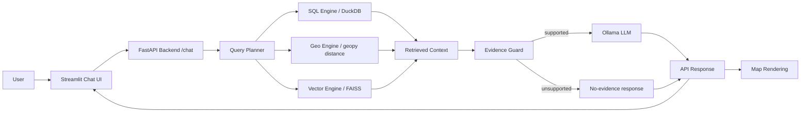
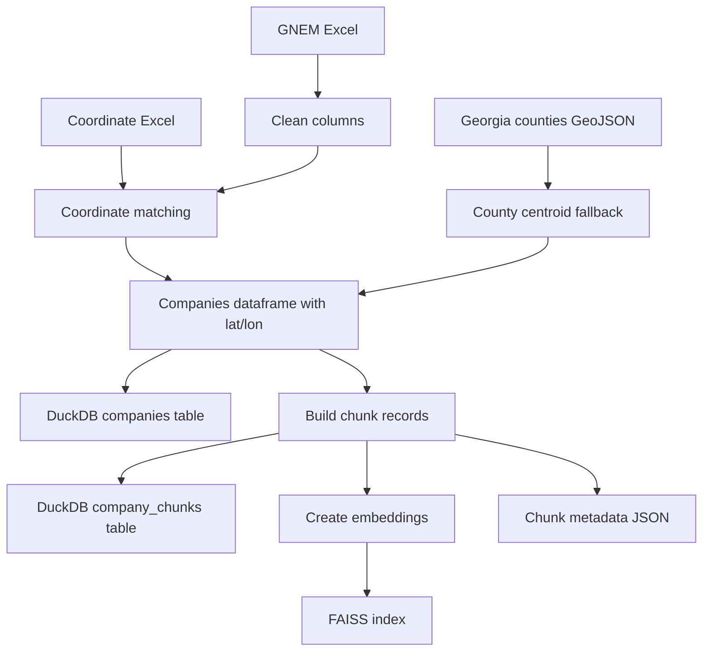
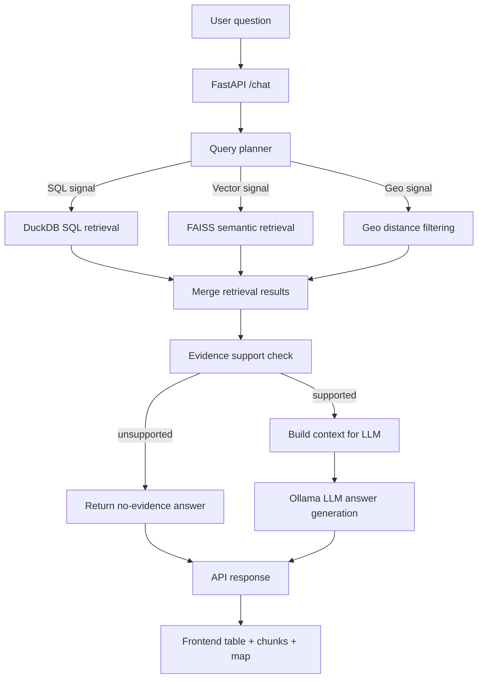
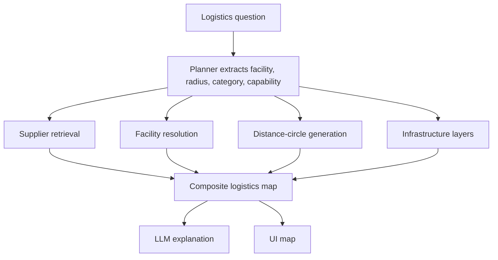

# Hybrid Geospatial RAG Chatbot: Functional and Technical Flow

This document explains how the current prototype works end to end:

- how data is ingested
- how questions are routed
- how retrieval works
- when the LLM is used
- how the map is generated
- why unsupported questions are refused

It reflects the current implementation in this project copy.

## 1. Current Goal

The system answers questions about the GNEM dataset by combining:

- structured retrieval from DuckDB
- semantic retrieval from FAISS
- geospatial distance filtering from latitude/longitude
- optional local LLM generation through Ollama

The system also renders a map of the retrieved companies.

Important distinction:

- the **answer text** may use an LLM
- the **map** does **not** use an LLM
- the map is created deterministically from coordinates

## 2. High-Level Architecture



## 3. Data Inputs

The current pipeline uses these sources:

- `data/gnem_companies.xlsx`
- `data/GNEM - Auto Landscape Lat Long Updated File (1).xlsx`
- `data/Counties_Georgia.geojson`

What each one provides:

- `gnem_companies.xlsx`
  - company metadata
  - supply-chain fields
  - industry information
  - product/service information
- `GNEM - Auto Landscape Lat Long Updated File (1).xlsx`
  - company latitude/longitude enrichment
  - company-level coordinate source
- `Counties_Georgia.geojson`
  - county geometry
  - fallback centroids when exact company coordinates are missing

## 4. Ingestion Flow

The ingestion script builds all retrieval assets before the app runs.

### 4.1 What ingestion does

1. Load the GNEM Excel file
2. Clean column names
3. Parse city/county from location text
4. Load the coordinate workbook
5. Attach latitude/longitude to companies
6. Use county centroid fallback if exact coordinates are missing
7. Build semantic chunk records
8. Store company rows in DuckDB
9. Store chunk rows in DuckDB
10. Build embeddings
11. Save FAISS index
12. Save chunk metadata JSON

### 4.2 Ingestion output artifacts

- `data/gnem.duckdb`
- `data/gnem_faiss.index`
- `data/vector_metadata.json`

### 4.3 Ingestion flow chart



### 4.4 Coordinate assignment logic

Coordinates are attached in this priority order:

1. use latitude/longitude already present on the source row
2. use exact `company + location` match from the coordinate workbook
3. use company-level coordinate workbook match
4. use county centroid fallback
5. mark as missing if none exists

This is why each company row has a `coordinate_source`.

Examples:

- `coordinates_excel:*`
  - came from the uploaded coordinate workbook
- `source_excel`
  - came directly from the main GNEM sheet
- `county_centroid`
  - approximate fallback
- `missing`
  - no usable coordinate found

## 5. Runtime Query Flow

When a user asks a question, the request goes through the following runtime path.

### 5.1 Functional steps

1. User asks a question in Streamlit
2. Frontend sends `POST /chat`
3. Backend query planner classifies the question
4. Relevant retrieval engines run
5. Retrieved results are merged
6. Evidence support is checked
7. If supported, the LLM generates the answer
8. If unsupported, the backend returns a no-evidence answer
9. Frontend renders:
   - answer text
   - sources
   - retrieved chunks
   - retrieved companies table
   - supplier map

### 5.2 Query flow chart



## 6. Query Planner

The planner decides which engines should run.

It classifies queries into:

- `SQL_QUERY`
- `GEO_QUERY`
- `VECTOR_QUERY`
- `HYBRID_QUERY`

### 6.1 Signals used by the planner

Examples of query signals:

- geospatial terms:
  - `near`
  - `within`
  - `distance`
  - `km`
  - `miles`
- business/entity terms:
  - `supplier`
  - `battery`
  - `OEM`
- metric terms:
  - `top`
  - `employment`

### 6.2 What the planner extracts

Depending on the question, it extracts hints such as:

- coordinates
- radius
- city
- OEM
- industry group
- category term
- capability term

Examples:

- `Which EV suppliers are near Atlanta?`
  - city = `Atlanta`
  - radius = `100 km` default
- `List battery companies within 100 km of 33.7490, -84.3880.`
  - coordinates = `(33.7490, -84.3880)`
  - radius = `100`
  - capability term = `battery`
- `Show me all Tier 2 Stamping suppliers within 50 miles of the Kia West Point facility.`
  - city = `West Point`
  - category term = `Tier 2`
  - capability term = `stamping`
  - OEM = `Kia`
  - radius = `80.467 km`

## 7. Retrieval Engines

The system has 3 retrieval engines.

### 7.1 SQL Engine

Used for:

- OEM filtering
- industry filtering
- top companies by metric
- structured field search

Typical queries:

- `Which companies supply Ford?`
- `Top companies by employment.`

### 7.2 Vector Engine

Used for semantic retrieval over company chunks.

Each company is split into multiple chunk types, for example:

- company profile
- supply chain
- products and capabilities
- geo operations

This allows better chunk-level semantic search.

Example chunk:

```text
Products and Capabilities
Company: Adient
Product / Service: Vehicle seating systems
Industry Group: Automotive
```

### 7.3 Geo Engine

Used for distance-based retrieval.

It supports:

- companies near a city
- companies within a coordinate radius

It computes `distance_km` for each matching row.

## 8. Evidence Guard

This is an important safety layer.

Problem it solves:

- semantic search always returns something
- unsupported questions can otherwise look like valid answers

Example of a bad query:

- `what is the capital of brazil?`

Without an evidence guard, the vector engine may still return random companies because embeddings always produce nearest neighbors.

What the guard does:

- checks whether retrieved evidence is actually relevant
- rejects weak unsupported matches
- returns a no-evidence answer instead of hallucinating from unrelated chunks

This is why the system now correctly refuses out-of-domain questions.

## 9. When the LLM Is Used

The local Ollama LLM is used only after retrieval and evidence validation.

The LLM does:

- convert retrieved evidence into a natural language answer
- cite chunk IDs like `[C1]`

The LLM does **not**:

- retrieve data
- calculate distance
- generate coordinates
- generate the map

### 9.1 LLM flow


### 9.2 If the LLM times out

The current implementation has a timeout-safe fallback summary for supported questions.

That means:

- supported query + slow model -> short retrieval-based fallback text
- unsupported query -> explicit no-evidence response

## 10. How the Map Is Generated

The map is deterministic and frontend-driven.

It is **not** created by an LLM.

### 10.1 Map input

The backend returns `retrieved_companies`.

Each company row may include:

- company
- city
- county
- latitude
- longitude
- distance_km
- coordinate_source
- map_weight
- map_weight_reason

### 10.2 Frontend map layers

The frontend creates two layers:

- `HeatmapLayer`
- `ScatterplotLayer`

This means:

- shaded density = heat intensity
- circles = actual company points

### 10.3 What the map actually represents

The current map is a **supplier result map**, not yet a full logistics infrastructure map.

It shows:

- retrieved supplier/company points
- cluster intensity of those points

It does **not yet** show:

- I-75
- I-85
- I-16
- Port of Savannah
- rail lines
- freight routes
- distance circles

## 11. How Map Weighting Works

Originally, the heatmap used employment as the weight.

That was replaced with a query-aware logistics score.

### 11.1 Current map weighting components

Each company gets a `map_weight` using a combination of:

- `map_relevance`
  - retrieval relevance from vector/semantic signals
- `map_query_match`
  - how much the row text overlaps the query
- `map_proximity`
  - closer results get more weight
- `map_business_priority`
  - category/role/facility-type importance
- `map_metric`
  - metric contribution for metric-driven queries

### 11.2 Simple interpretation

If two suppliers both match the query, but one is:

- closer to Atlanta
- more strongly tied to the query
- more important from a business/category perspective

then it gets:

- stronger heat contribution
- larger circle marker

### 11.3 Tooltip explanation

Each map point includes a reason string, for example:

```text
retrieval=0.60, query_match=0.33, proximity=0.67, business=0.85
```

That means the frontend map is now query-aware instead of just employment-weighted.

## 12. End-to-End Example 1: Geo Query

Question:

```text
Which EV suppliers are near Atlanta?
```

### What happens

1. Planner marks it as a hybrid geo/vector query
2. City is extracted as `Atlanta`
3. Vector engine finds supplier-related chunks
4. Geo engine filters nearby companies around Atlanta
5. Final company rows are returned
6. Backend computes `map_weight`
7. Frontend plots those rows on the map
8. LLM generates a text answer from retrieved chunks

### Result

- answer text
- retrieved chunks
- company table
- map centered on the returned results

## 13. End-to-End Example 2: Unsupported Question

Question:

```text
what is the capital of brazil?
```

### What happens

1. Planner cannot extract a meaningful GNEM-domain request
2. Vector search still returns nearest neighbors
3. Evidence guard checks the relevance quality
4. Evidence is rejected as unsupported
5. Backend returns:
   - no-evidence answer
   - no sources
   - no companies
   - no map points

### Why this matters

This prevents false answers that are unrelated to the GNEM dataset.

## 14. End-to-End Example 3: Metric Query

Question:

```text
Top companies by employment.
```

### What happens

1. Planner identifies a SQL/metric query
2. SQL engine runs top-by-employment query
3. Final result rows are returned from DuckDB
4. Backend computes `map_weight`
5. Frontend maps those companies if they have coordinates

### Map behavior

For a metric query like this, the metric contributes to the map score.

## 15. Current Functional vs Future Target

### What is implemented now

- GNEM tabular retrieval
- company semantic search
- geospatial proximity filtering
- supplier result map
- query-aware heat weighting
- unsupported-question refusal

### What is not yet implemented

- Georgia logistics infrastructure overlays
- interstate polyline layers
- rail layers
- port layers
- facility anchor markers
- freight distance circles
- full logistics heatmap visualization

## 16. How the Full Logistics Heatmap Would Be Built Next

To reach the target visualization:

### Additional layers needed

- interstate GeoJSON
- rail line GeoJSON
- port coordinates/polygons
- facility coordinate table

### Additional map features needed

- facility markers
- distance-circle overlay
- interstate polylines
- rail polylines
- port marker/polygon
- layer toggles and legend

### Future target flow chart



## 17. Summary

In one sentence:

The current system retrieves GNEM company evidence using SQL, vector, and geospatial filtering, validates whether the evidence is relevant, optionally uses Ollama to write the answer, and renders the returned company coordinates as a query-aware supplier map in the frontend.

In another sentence:

The map is not AI-generated; it is plotted directly from retrieved coordinates.
